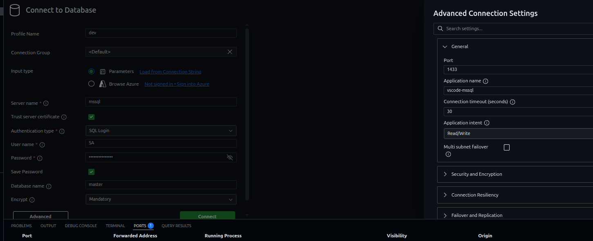

# Section 2: T-SQL and MS SQL
This section assesses your knowledge of Transact-SQL (T-SQL) and Microsoft SQL Server (MSSQL) concepts, including stored procedures, functions and integration with .NET/.NET Framework. 

## Setting up SQL Server for T-SQL and MSSQL coding exercise

An MSSQL instance should be automatically started via docker-compose in the .devcontainer when the Codespace is created.

You can connect to the mssql in the command palette 

1. Press _F1_ and type MS SQL:Add Connection

``` 
Host: mssql
Port: 1433
User: SA
Password: P@ssw0rdStrong!
Trusted: Check
```
```
In the advanced option, add the port number 
```



2. to set up the TestDB and Tables, connect to the SQL Server Instance and execute the following scripts
    - [x] create_database_table.sql

3. Once the connection to the MSSQL established, right click on the .sql file extension and click on execute query.

> Note: 
> 
> You might need to install the .NET and MS-SQL extensions if using local docker environment in your visual studio code

## Questions

1. For the theoretical questions, refer to the following file, write your answers inside, and commit:
    - [x] 01_tql_question.md

2. For coding exercise, refer to the question and write your answer in the following files:
    - [x] 01_tsql_question.sql 
    - [x] 02_tsql_question.sql 
    - [x] 03_tsql_question.sql 
